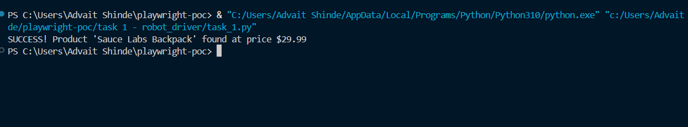

# Robot Driver — Single-File POC (Playwright + Python)

## Output Screenshots



---

Automates a browser to:

1. Open https://www.saucedemo.com/
2. Log in (demo creds)
3. Find a product by name
4. Print its price, or a clear failure message

## Setup

```
# 1. install requirements
pip install playwright

# 2. install browsers
playwright install

# 3. run python file
python -m task_1.py

```
