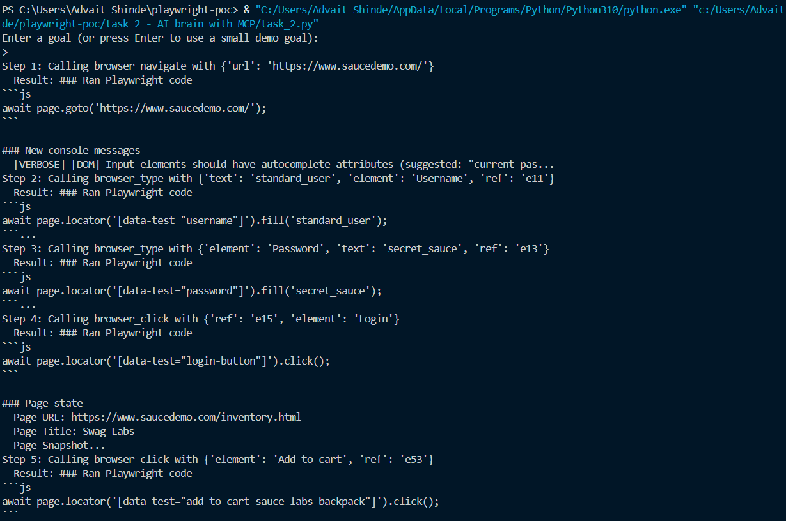
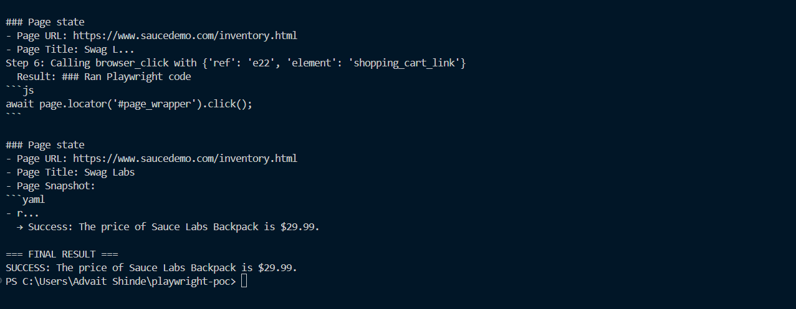

# Web Automation Agent with Gemini & MCP

A simple web automation agent that uses Google's Gemini AI to navigate websites and complete tasks autonomously using the Model Context Protocol (MCP) with Playwright.

## Output Screenshots





## Overview

This agent can:

- Navigate websites automatically
- Fill forms and click buttons
- Complete multi-step workflows (e.g., login, add to cart, checkout)
- Extract information from pages
- Make decisions based on page content

The agent uses Gemini 2.0 Flash as the reasoning engine and Playwright (via MCP) for browser automation.

## How It Works

1. **Agent receives a goal** - User provides a task description (e.g., "Log in and find product price")
2. **Take snapshot** - Browser captures accessibility snapshot with element references
3. **Gemini analyzes** - AI model examines snapshot and decides next action
4. **Execute action** - Calls appropriate browser tool (navigate, click, type, etc.)
5. **Repeat** - Continues until goal is achieved or max steps reached

## Prerequisites

- Python 3.8+
- Node.js and npm (for Playwright MCP server)
- Google Gemini API key

## Installation

1. Install Python dependencies:

```bash
pip install mcp google-genai python-dotenv
```

2. Install Playwright MCP server:

```bash
npm install -g @playwright/mcp
```

3. Create `.env` file with your API key:

```
GEMINI_API_KEY=your_api_key_here
```

## Usage

Run the script:

```bash
python main.py
```

You'll be prompted to enter a goal. Press Enter to use the default demo goal, or type your own:

```
Enter a goal (or press Enter to use a small demo goal):
> Log in on saucedemo with the standard user and report the price of 'Sauce Labs Backpack'.
```

### Example Goals

- "Log in and report the price of Sauce Labs Backpack"
- "Add two items to cart and tell me the total"
- "Navigate to the about page and summarize the content"

## Configuration

Edit these variables in the script:

- `MODEL` - Gemini model to use (default: "gemini-2.0-flash-exp")
- `MAX_STEPS` - Maximum automation steps (default: 15)
- `HEADLESS` - Run browser without GUI (default: True)
- `DEFAULT_START_URL` - Starting URL (default: "https://www.saucedemo.com/")

## Output

The agent will print:

- Each step and action taken
- Tool results and responses
- Final success/failure message with requested information

Example output:

```
Step 1: Calling browser_navigate with {'url': 'https://www.saucedemo.com/'}
Step 2: Calling browser_type with {'element': 'username', 'ref': 'e11', 'text': 'standard_user'}
...
→ Success: The price of Sauce Labs Backpack is $29.99
```

## Notes

- Free tier Gemini API has rate limits (10 req/min)
- Agent includes automatic retry logic for rate limits
- Default timeout is 15 steps to prevent infinite loops
- Works best with structured websites that have good accessibility markup
