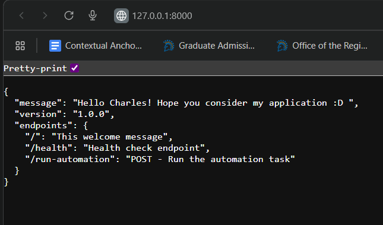
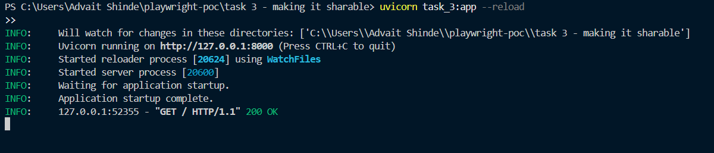
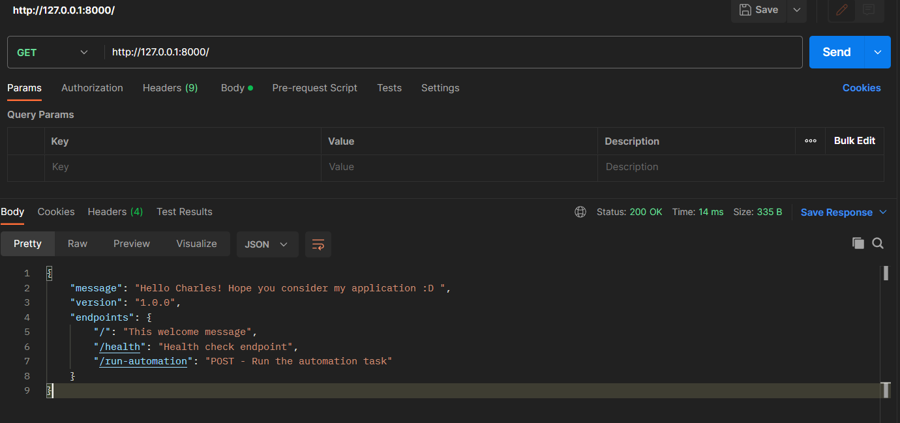
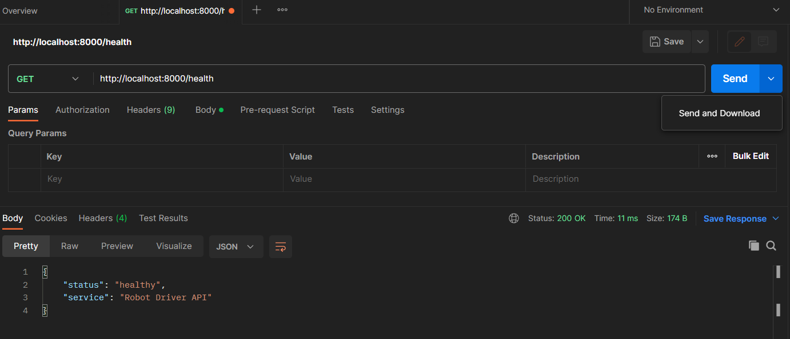

# Making it shareable

I have created a REST API that:

- Runs your robot automation when someone makes a web request
- Returns the results (success/failure and price info)
- Can be accessed from any HTTP client (browser, Postman, curl, etc.)

## Output Screenshots






- `output_screenshots/output_1.png`
- `output_screenshots/output_2.png`
- `output_screenshots/output_3.png`
- `output_screenshots/postman_healthcheck.png`

---

## Setup & Run

### 1. Install dependencies

```bash
pip install -r requirements.txt
```

### 2. Start Server

```bash
uvicorn test_3:app --reload
```

### 3. Postman

```bash
test on postman
```
